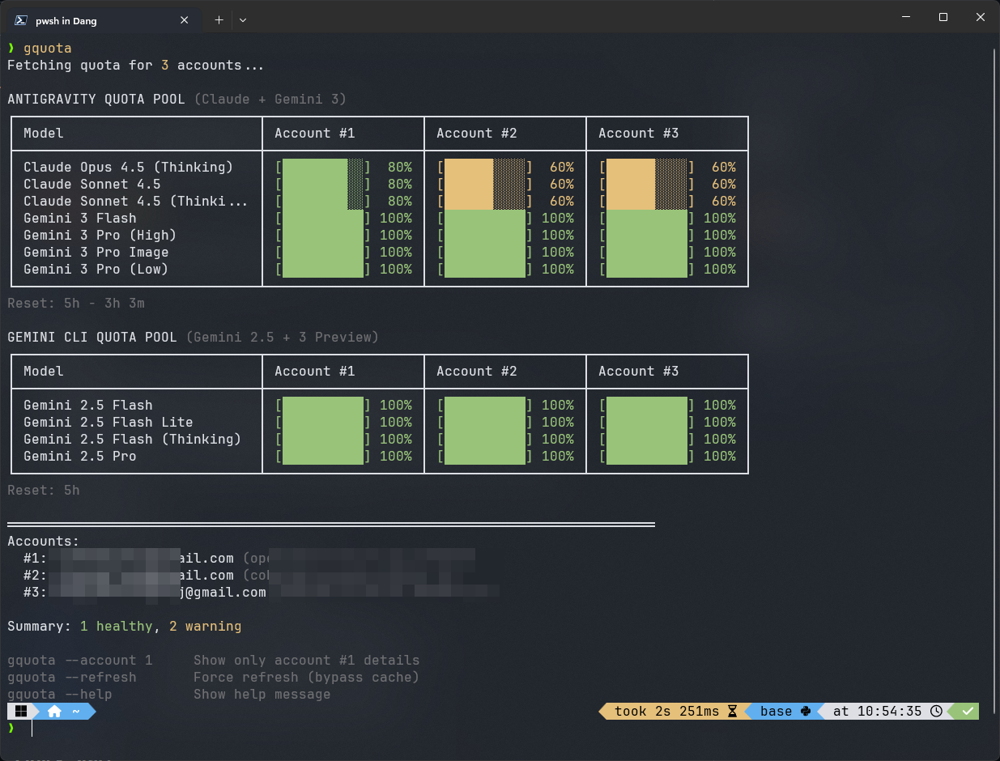

# opencode-antigravity-quota

**The ultimate Google Antigravity quota monitoring tool for OpenCode.**

[](https://www.npmjs.com/package/opencode-antigravity-quota)
[](LICENSE)

Monitor your **Gemini** and **Claude** model quotas across multiple Google accounts in real-time. Designed for power users who manage multiple Antigravity accounts.



## Highlights

- **Multi-Account:** Instantly check quota status for all your authenticated accounts.
- **Unified View:** Pivot table layout to compare models side-by-side.
- **Visual Feedback:** Color-coded progress bars (Green/Yellow/Red) for intuitive health checks.
- **Smart Caching:** 10-minute caching prevents API rate limits.
- **CLI & Plugin:** Works as a standalone terminal tool (`gquota`) or inside OpenCode (`/quota`).

## Documentation

Detailed guides are available in the [`docs/`](./docs) directory:

| Guide | Description |
|-------|-------------|
| [**Installation**](./docs/INSTALLATION.md) | Setup guide for CLI and OpenCode plugin. |
| [**Usage**](./docs/USAGE.md) | Commands, options, and how to read the output. |
| [**Troubleshooting**](./docs/TROUBLESHOOTING.md) | Fix common errors (Auth, API 403, Cache). |
| [**Architecture**](./docs/ARCHITECTURE.md) | Internal logic and data flow (for developers). |

## Quick Start

> **Tip:** Too lazy to type commands? Try the [**AI Agent Quick Install**](./docs/INSTALLATION.md#ai-agent-quick-install).

### Install from Source

```bash
# Clone the repository
git clone https://github.com/ninhhaidang/opencode-antigravity-quota.git
cd opencode-antigravity-quota

# Install & Link
npm install
npm run build
npm link

# Run
gquota
```

## Contributing

Contributions are welcome! Please submit Pull Requests to the [GitHub repository](https://github.com/ninhhaidang/opencode-antigravity-quota).

## License

MIT © [NinhHaiDang](https://github.com/ninhhaidang)
