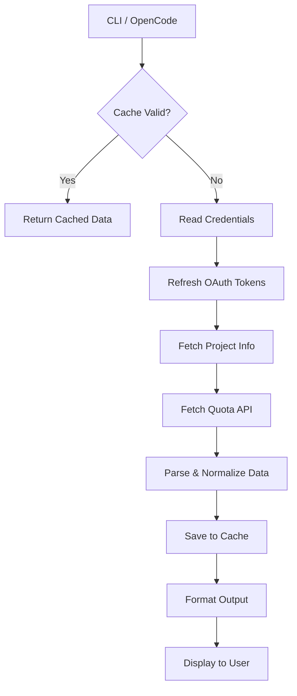

# Architecture Reference

This document outlines the internal design of `opencode-antigravity-quota`.

## System Overview

The tool is designed as a pipeline that:
1.  **Ingests** credentials from `opencode-antigravity-auth`.
2.  **Fetches** real-time data from Google's internal APIs.
3.  **Processes** the raw JSON into structured models.
4.  **Visualizes** the data using ANSI-enhanced text.

## Directory Structure

```
src/
├── index.ts       # Main entry point for OpenCode plugin interface
├── cli-args.ts    # CLI argument parser (flags handling)
├── auth.ts        # Credential loading & OAuth token refreshing
├── quota.ts       # Core logic: Fetching & parsing API responses
├── format.ts      # UI logic: Pivot tables, progress bars, ANSI colors
├── cache.ts       # File-system caching layer
├── constants.ts   # Configuration constants (API URLs, colors)
└── types.ts       # TypeScript type definitions

bin/
└── cli.mjs        # Executable wrapper for the CLI command
```

## Key Components

### 1. Authentication (`auth.ts`)
*   Does NOT handle login (delegated to `opencode-antigravity-auth`).
*   Responsibility: Reads `antigravity-accounts.json` and refreshes expired Access Tokens using the stored Refresh Token.

### 2. Quota Fetching (`quota.ts`)
*   **API Endpoint:** `https://clients6.google.com/service/checkin/.../quota`
*   **Logic:**
    *   Fetches project tier info first.
    *   Fetches raw quota data.
    *   Filters relevant models (Gemini/Claude).
    *   Calculates usage percentages.

### 3. Caching Layer (`cache.ts`)
*   **Storage:** JSON file in user's config directory.
*   **Strategy:** "Read-through".
*   **TTL:** Default 10 minutes.
*   **Invalidation:** CLI `--refresh` flag clears the specific cache key.

### 4. Formatting Engine (`format.ts`)
*   **Pivot Table:** Dynamically calculates column widths based on content.
*   **Unicode Blocks:** Renders `█` and `░` for high-fidelity progress bars.
*   **Responsive:** Adapts to different model lists per account.

## Data Flow


